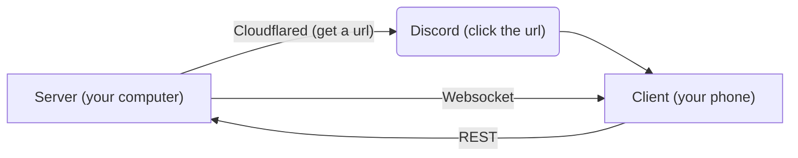

---
Scuttle is a responsive web-based audio archival tool for managing and playing your personal audio collection.

- Search and download audio
- Play, pause, and skip tracks
- Create and manage playlists
- Self-host your audio library and stream to any device with a browser
- Imports playlists from external services (e.g. Spotify) to mirror or organize your personal collection

This requires Python 3.8+ to install. Setting up will install binaries for ffmpeg and cloudflared. You can run Scuttle by downloading this as a zip, and running ```scuttle.bat``` on Windows (No support for one-click setup on Linux or Mac yet). For manual setup see [installation](#installation) and [usage](#usage) for more details. No support for automatic updates yet.

### Table of Contents
- [Installation](#installation)
- [Usage](#usage)
- [Architecture](#architecture)
- [Dependencies](#dependencies)
- [Bugs](#known-issues)
- [Future features](#future-features)
- [License](#license)
- [Disclaimer](#disclaimer)


## Installation

### 1. Clone the repository
Navigate to a folder where you want to put Scuttle, open a terminal and run:
```bash
git clone https://github.com/whimsypingu/scuttle.git
```

Then run this to preview options:
```bash
cd scuttle
```

```bash
python main.py --help
```

For Windows, the ```scuttle.bat``` file can be double-clicked to perform all setup.
No one-click installer for Linux or Mac yet.


### 2. Setup the environment
Run the setup script to prepare the python environment. This will:
* Create a Python virtual environment (```/venv```)
* Install all required python library dependencies (please see ```/requirements.txt``` in [dependencies](#dependencies))
* Download a ```cloudflared``` executable for tunneling from [the official open source repository](https://github.com/cloudflare/cloudflared/releases/latest/)
* Install ffmpeg into the virtual python environment if necessary (Only for Windows right now)

```bash
python main.py --setup
```

### 3. Activate the virtual environment
Before running the server, activate the virtual environment:

| Platform             | Command                     |
| -------------------- | --------------------------- |
| Windows (cmd)        | `venv\Scripts\activate`     |
| Windows (PowerShell) | `venv\Scripts\Activate.ps1` |
| macOS/Linux          | `source venv/bin/activate`  |


## Usage

### 1. Start the server
Ensure you've [activated the virtual environment](#3-activate-the-virtual-environment) first. 

Run:
```bash
python main.py
```


#### 1.1 (Optional) Set up Discord webhook notifications:
Scuttle can provide the tunneled link to a Discord channel using a webhook URL, so you can access your audio on any device that has access to the channel. To set this up:

1. Follow [this official guide](https://support.discord.com/hc/en-us/articles/228383668-Intro-to-Webhooks) to get a Discord webhook URL (~2 min)
2. Run the following command to save the webhook URL to your `.env` file:
```bash
python main.py --set-webhook [URL]
```

💡 While the server is running, your device will stay awake to maintain the connection, though the display may turn off to conserve battery. Note that closing a laptop may turn off the server (at least, it did for me once).


### 2. Shut down the server
Press ```Ctrl+C``` in the terminal to shut off the server and allow your device to sleep normally again.


## Architecture
Scuttle was built to provide users with a free and simple audio streaming service. At a really basic level it consists of a client-server model:

- **Backend (Python)**
    - Runs a local HTTP server using FastAPI
    - Handles audio download, library management, and tunneling (via Cloudflared).
- **Frontend (JavaScript)**
    - Responsive web UI served by the backend
    - Handles playback, queue management, playlists, etc
    - Communicates with server through REST and Websocket endpoints




## Dependencies
This project requires Python 3.8+ and the following Python packages:

- **yt-dlp** – Download and manage audio/video content.  
- **FastAPI** – Web framework for building the backend API.  
- **uvicorn[standard]** – ASGI server to run the FastAPI app.  
- **websockets** – Real-time communication support.  
- **pydantic** – Data validation and parsing.  
- **python-dotenv** – Load environment variables from `.env` files.  
- **requests** – Make HTTP requests to external APIs.

These are installed during [setup of the virtual environment](#2-setup-the-environment). You can install all dependencies manually with:
```bash
pip install -r requirements.txt
```


## Project structure
```bash
scuttle/
├─ backend/             # Backend API and database
├─ boot/                # Setup scripts
├─ frontend/            # Web UI assets and logic
├─ tests/               # Um ignore this
├─ tools/               # Tunnel binary
├─ venv/                # Virtual environment (created by setup)
├─ .env                 # Environment variables (auto-generated)
├─ main.py              # Entry point for the application
├─ requirements.txt     # Required libraries
├─ sw.js                # Service worker
```


## Known Issues
There are some known bugs that haven't been bothered to be fixed yet.
* Cleaning out unused downloads (Done, but only on restart)
* yt-dlp updating in case of failure
* yt-dlp download options and timeout failure cleanup/notification on frontend.
* Clearing DNS cache (Occasionally breaks cloudflared. If tunnel can't be resolved, clear the cache in command line and retry)
* Potential breakage of floating point indexing of database after many re-orders - just re-normalize indices per playlist every now and then. Have to find an optimal time to do this though, and the willpower to write the code.


## Future Features
Scuttle is still in active development. Here are some planned features and improvements grouped by category:

**User Experience:**
- [ ] Tracking user audio actions and usage, to provide a recap by month or even suggest artists or creators to donate to or support based on percentage listened
- [ ] Mobile UI improvements (swipe on queue to play next)
- [x] Auto queue songs in a playlist on download
- [ ] Improved search functionality
- [ ] Pagination for faster loading with larger libraries
- [x] Optimized rendering for faster UI performance
- [x] Audio volume normalization across tracks [11/14/25, loudnorm EBU-R128 standard]

**Integrations:**
- [ ] Import playlist from YouTube, other sources
- [ ] User authentication and multi-user support
- [ ] Syncing to a central server (?) for recommendations
- [ ] Virtual network option (Tailscale?)
- [ ] Recommendations (Last.fm?)

**Tools:**
- [x] Audio editing (silence removal, enhanced quality) [11/14/25, trim + .opus]
- [ ] Backend management from the web interface (download queue, server restart)

These are not guaranteed but they reflect the current development priorities and ideas for future releases.

Current work (January 2026) on improved search functionality is being done at [this Google Colab notebook](https://colab.research.google.com/drive/1HxKu_tEEJH7ogdjZbwvDclMa_zlTcASP?usp=sharing). 


## License
This project is licensed under the [MIT License](./LICENSE).


## Disclaimer
Scuttle is provided for **personal, non-commercial use** only.
The developers do not **not endorse, support, or encourage downloading copyrighted material** without permission.
You are solely responsible for complying with all applicable laws and the terms of service of any platforms you interact with.
This project is intended to help users **archive, manage, and listen to their own legally obtained audio collections**. The developers are not responsible for any misuse of this software.
